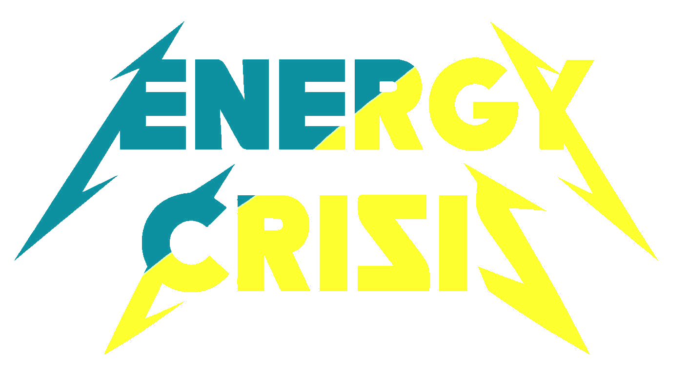
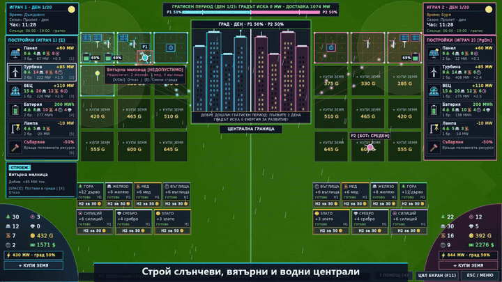
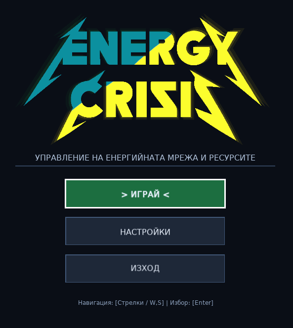
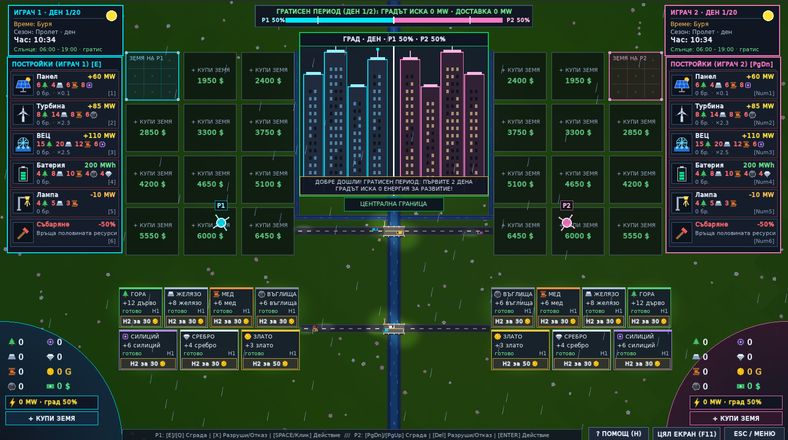
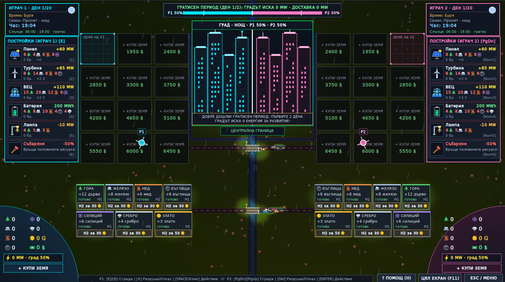
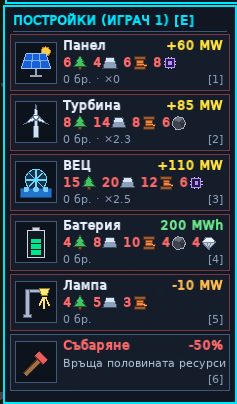
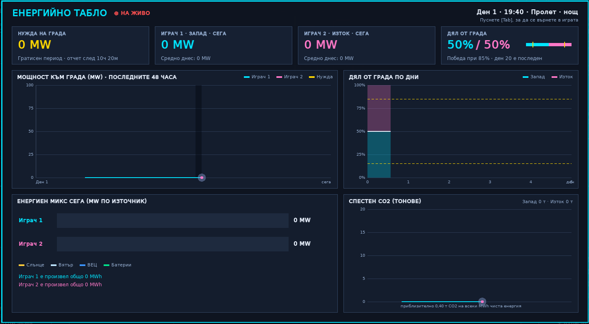

<p align="center">
  
</p>

<p align="center"></p>

<p align="center"><b>Отбор „Волтова дъга“</b> · <a href="https://docs.google.com/presentation/d/1UWAW4F5tHmk3Gq4c1k7os5S4UIRC3If5KsrRFCIdVAM/edit?usp=sharing">Презентация (Google Slides)</a> · <a href="presentation/index.html">Презентация (HTML)</a> · <a href="presentation/media/trailer.mp4">Трейлър</a> · <a href="NEW_FEATURES.md">Какво е новото</a></p>

<h3 align="center">Енергийна криза: състезание за тока на един растящ град</h3>

**Energy Crisis** е стратегическа игра в реално време за двама играчи на един компютър (или един играч срещу бот). Двама енергийни магнати добиват ресурси, купуват земя, строят слънчеви, вятърни и водни централи, батерии и лампи и се борят да захранят мегаполиса между тях. Който доставя енергия по-надеждно, печели територия в града. Който завладее 85% от града (или има по-голям дял след ден 20), побеждава.

Играта е написана на **C++17** с **SFML 3** и е създадена от ученици за училищен хакатон на тема енергиен преход.

> ⚠️ Чернова на документацията. Елементите, отбелязани с „(в разработка)“, се изграждат в момента и ще бъдат потвърдени във финалната версия.

---

## 📸 Екранни снимки

| Главно меню | Мач в ход | Нощ и буря |
| :---: | :---: | :---: |
|  |  |  |
| *[снимка: главно меню с логото и новия фон]* | *[снимка: двата сектора, градът и лентата на влиянието]* | *[снимка: лампи, батерии и мълния]* |

| Строително меню с икони | Дневен отчет | Табло с графики (Tab) |
| :---: | :---: | :---: |
|  |  |  |
| *[снимка: цени като число + икона, зелено/червено]* | *[снимка: карта с резултата от деня] (в разработка)* | *[снимка: живи графики на MW, търсене и CO₂] (в разработка)* |

---

## ✨ Акценти

- **Двубой на един екран:** Западният сектор (Играч 1) срещу Източния сектор (Играч 2), а между тях градът, който всеки ден иска повече ток.
- **Седем ресурса и пет вида сгради:** дървесина, желязо, мед, въглища, силиций, сребро и злато се превръщат в слънчеви панели, вятърни турбини, ВЕЦ, батерии и осветителни лампи.
- **Жив свят:** денонощие от 90 секунди, четири сезона с различен изгрев и залез, отделно време за всеки сектор (слънце, вятър, дъжд, буря, сняг) и мълнии.
- **Честно отчитане:** градът отчита веднъж на ден, в 06:00, колко енергия всеки играч е доставил през целия ден.
- **Бот с четири нива:** ЛЕСНО, СРЕДНО, ТРУДНО и НЕВЪЗМОЖНО (в разработка), плюс петима съперници с различен характер (в разработка).
- **Икони вместо текст:** строителното меню показва цената като число и икона на ресурса, в зелено, ако имате достатъчно, и в червено, ако не стига.
- **Демо режим за журито** (в разработка): един клавиш пуска сигурна 3-минутна демонстрация на най-интересните моменти.

---

## 🚀 Бърз старт

### Изисквания

| Компонент | Версия |
| :--- | :--- |
| Компилатор | C++17 (GCC 9+; тествано с GCC 14.2 / MinGW-w64) |
| Графична библиотека | **SFML 3.0 или по-нова** (тествано със SFML 3.1.0); SFML 2.x не работи |
| Инструменти | `make` (Linux/macOS) или `mingw32-make` (Windows) |

### Linux

```bash
sudo apt install build-essential   # плюс SFML 3 (от пакетите или собствена компилация)
make            # компилира играта
make run        # стартира играта
```

### Windows (MinGW-w64 + SFML 3.1)

```bash
g++ -std=c++17 -IUI/includes -IGame/includes -IC:/SFML-3.1.0/include main.cpp UI/scr/*.cpp Game/scr/*.cpp -LC:/SFML-3.1.0/lib -lsfml-graphics -lsfml-window -lsfml-system -o EnergyCrisis.exe
```

След компилацията копирайте `sfml-graphics-3.dll`, `sfml-window-3.dll` и `sfml-system-3.dll` до `EnergyCrisis.exe`. Стартирайте играта от главната папка на проекта, за да намери папката `assets/`.

### CMake (в разработка)

```bash
cmake -B build
cmake --build build --parallel
```

### Тестове без графика

```bash
make test             # компилира и пуска тестовете на двигателя (без SFML)
make test EC_SEED=42  # същото време и същите случайни събития при всяко пускане
```

Подробности: [docs/TESTING.md](docs/TESTING.md).

---

## 🎮 Режими на игра

| Режим | Описание |
| :--- | :--- |
| **Двама играчи** | Двама души на споделена клавиатура, мишка или **DevHub One аркадна конзола**. |
| **Срещу бот** | Играч 1 срещу компютъра на ниво ЛЕСНО, СРЕДНО или ТРУДНО. |
| **Обучение** | Интерактивен урок, който води новия играч до първата му централа. |
| **Демо режим за журито** | Сценарий от 3 минути с един клавиш (в разработка). |

---

## 🕹️ Управление накратко (Клавиатура & DevHub One Аркада)

| Действие | Играч 1 (Запад) | Играч 2 (Изток) | DevHub One Аркада / Геймпад |
| :--- | :--- | :--- | :--- |
| **Движение** | `W` `A` `S` `D` | Стрелки `↑` `←` `↓` `→` | **Аркаден стик 1 / 2** (или D-Pad) |
| **Добив / строеж / действие** | `Space` | `Enter` | **Бутон 1** (`A`) или `Start` |
| **Отказ / премахване** | `X` | `Delete` | **Бутон 2** (`B`) или `Coin` / `Select` |
| **Надграждане на мина** | `F` | `Right Shift` или `End` | **Бутон 3** (`X`) или `LB` |
| **Следваща сграда** | `E` | `Page Down` | **Бутон 4** (`Y`) или `RB` |
| **Предишна сграда** | `Q` | `Page Up` | **Бутон 5** (`LB`) |
| **Пауза / помощ** | `Esc` / `F1` или `H` | `Esc` / `F1` или `H` | **Start** (Бутон 7) или **Coin** (Бутон 6) |
| **Цял екран** | `F11` / `Alt+Enter` | `F11` / `Alt+Enter` | `F11` |

> 🎮 **DevHub One Аркадна конзола:** Играта включва пълна хардуерна поддръжка за физически аркадни кабинети и USB геймпади с plug-and-play разпознаване на джойстиците, навигация в менютата без мишка и специална 5-та схема на управление в менюто за старт!
> 
> ⚙️ В **НАСТРОЙКИ ➔ КОНТРОЛИ** можете да пренастройвате всеки клавиш индивидуално и да следите състоянието на свързаните DevHub One аркадни контролери.

Пълната таблица, мишката, геймпадът и настройките са описани в [docs/CONTROLS.md](docs/CONTROLS.md).

---

## 📚 Документация

| Документ | Съдържание |
| :--- | :--- |
| [GAMEPLAY.md](docs/GAMEPLAY.md) | Всички правила и системи с числа: ресурси, сгради, енергия, град, време, победа |
| [CONTROLS.md](docs/CONTROLS.md) | Клавиатура, мишка и геймпад за двамата играчи |
| [ARCHITECTURE.md](docs/ARCHITECTURE.md) | Двигател и интерфейс, основни класове, поток на данните |
| [AI.md](docs/AI.md) | Как мисли ботът, нива на трудност и личности |
| [TESTING.md](docs/TESTING.md) | Тестове без графика, детерминизъм, CI |
| [CHANGELOG.md](docs/CHANGELOG.md) | Какво поправихме и подобрихме |
| [PRESENTATION.md](docs/PRESENTATION.md) | Презентация за журито на хакатона · [Google Slides](https://docs.google.com/presentation/d/1UWAW4F5tHmk3Gq4c1k7os5S4UIRC3If5KsrRFCIdVAM/edit?usp=sharing) |
| [NEW_FEATURES.md](NEW_FEATURES.md) | Новите функции накратко: какво са, как се показват и кои 8 да покажете на журито |

---

## 🗂️ Структура на проекта

```
Energy-Crisis/
├── assets/        # шрифт, текстури, лого, фон
├── Game/          # двигател на играта (правила, икономика, време, град), без графика
│   ├── includes/  # game_main.h, game_balance.h, game_time.h, game_weather.h ...
│   └── scr/       # game_main.cpp, game_weather.cpp, game_random.cpp ...
├── UI/            # графичен интерфейс на SFML (карта, менюта, бот, обучение, HUD)
│   ├── includes/
│   └── scr/
├── scratch/       # тестове на двигателя (make test)
├── docs/          # документация
├── main.cpp
└── Makefile
```

---

## 👥 Екип

| Име | Роля |
| :--- | :--- |
| *[Име]* | *[роля, напр. двигател и баланс]* |
| *[Име]* | *[роля, напр. интерфейс и графика]* |
| *[Име]* | *[роля, напр. бот и тестове]* |

Училище: *[име на училището]* · Хакатон: *[име и дата]*

---

## 📄 Лиценз и ресурси

- Лиценз на кода: *[да се уточни]*
- Шрифт: DejaVu Sans (лиценз DejaVu Fonts, свободен за използване и разпространение).
- Логото и фонът са създадени от екипа.
