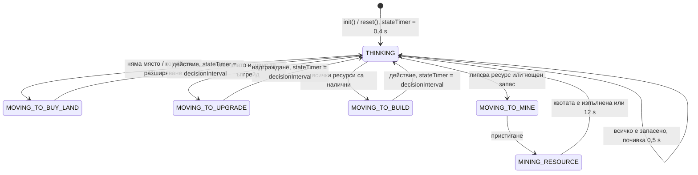

> Чернова — ще бъде финализирана след приключване на разработката.

# Компютърен опонент (бот)

Документът описва как работи ботът в режим „Самостоятелна игра“ днес, какви са параметрите на трудностите в кода и какво предстои: трудност **НЕВЪЗМОЖНО**, ограничител на излишната мощност (BAL-01), личности на съперниците (F-17) и преместване на бота в енджина. Описано е състоянието на клон `Claude-code` към 03.10.2026 (commit `0ee54a6`). Всичко, което още не съществува, е отбелязано с **(в разработка)**.

Код: `UI/includes/UI_bot.h`, `UI/scr/UI_bot.cpp` (около 480 реда), управление от `UI/scr/UI_map_controls.cpp:454-481`.

## Съдържание

1. [Мястото на бота в играта](#1-мястото-на-бота-в-играта)
2. [Състояния](#2-състояния)
3. [Планиране: `planNextAction`](#3-планиране-plannextaction)
4. [Трудности: ЛЕСНО, СРЕДНО, ТРУДНО](#4-трудности-лесно-средно-трудно)
5. [НЕВЪЗМОЖНО (в разработка)](#5-невъзможно-в-разработка)
6. [Ограничител на излишната мощност BAL-01 (в разработка)](#6-ограничител-на-излишната-мощност-bal-01-в-разработка)
7. [Личности на съперниците F-17 (в разработка)](#7-личности-на-съперниците-f-17-в-разработка)
8. [Известни ограничения](#8-известни-ограничения)
9. [План: ботът в `Game/` (в разработка)](#9-план-ботът-в-game-в-разработка)

---

## 1. Мястото на бота в играта

- `UIBot` е член на `UI_map` и винаги управлява **Играч 2** (източния сектор). Трудността се задава от менюто чрез `UI_map::setBotDifficulty()` → `UIBot::init()`.
- Всеки кадър `UI_map::updateControls()` вика `bot.update(dt, engine, nodes, p2Pos, ...)` (`UI/scr/UI_map_controls.cpp:468`). Ботът мести курсора на Играч 2 (`p2Pos`) и връща три сигнала: „натисни действие“, „надгради мина“ и „избрана сграда“.
- `UI_map` прилага сигналите **по същия път като за човек**: `executeP2Action()` (добив, строеж или купуване на земя според позицията на курсора) и `executeP2Upgrade()`. Между две действия има пауза от 0,15 s (`p2ActionCooldown`), а добивът има същата пауза от 1 s (`Balance::MINE_COOLDOWN_SEC`) като за човека (`UI/scr/UI_map_controls.cpp:294-303`).
- Затова ботът **не мами**: плаща същите рецепти, строи само върху закупена земя, нощем само в осветена клетка, ВЕЦ само на брега на реката, и трябва физически да стигне с курсора до мината или клетката. Ботът не ускорява времето (ускорението ×6 зависи само от хората, `UI/scr/UI_map_controls.cpp:393-398`).
- Ботът чете състоянието директно от енджина: своята икономика (`getPlayerEconomy(2)`), времето в своя сектор, дали е ден, парцелите, сградите, осветените клетки, бреговите клетки и цените. Позициите на мините взима от `UI_resourceNodes::getStation()`. **Не** гледа Играч 1 и **не** гледа търсенето на града.
- Модалните диалози на Играч 2 са винаги затворени, докато играе бот (`UI/scr/UI_map_controls.cpp:456`).
- На ЛЕСНО и СРЕДНО обучението задържа бота, докато играчът го завърши или пропусне, но най-много 60 реални секунди (`TUTORIAL_BOT_HOLD_SEC`, `UI/includes/UI_map.h:188`). На ТРУДНО обучението се пропуска.

## 2. Състояния

`BotActionState` (`UI/includes/UI_bot.h:10-17`):

| Състояние | Какво прави ботът |
| --- | --- |
| `THINKING` | Брои `stateTimer` до нула и вика `planNextAction()`. |
| `MOVING_TO_MINE` | Върви към мината на нужния ресурс. |
| `MINING_RESOURCE` | Стои на мината и „натиска“ добив на всеки `mineHitInterval`, докато наличността достигне квотата или изтекат 12 s (защита от зацикляне). |
| `MOVING_TO_BUILD` | Върви към избраната свободна клетка с избрана сграда (вижда се „призракът“); при пристигане натиска действие. |
| `MOVING_TO_BUY_LAND` | Върви към центъра на най-евтиния незакупен парцел и натиска действие. |
| `MOVING_TO_UPGRADE` | Върви към бутона за надграждане на мината и натиска надграждане. |



Движението е праволинейно с постоянна скорост `moveSpeed` (пиксели в секунда); ботът „пристига“, когато остават под 10 px или под една стъпка (`UI/scr/UI_bot.cpp:401-421`). Ако строежът не успее (например е паднала нощ, докато ботът е вървял), ботът просто планира наново при следващото мислене.

## 3. Планиране: `planNextAction`

`UIBot::planNextAction()` (`UI/scr/UI_bot.cpp:62-383`) е **целево планиране**: първо избира *какво* да построи, после смята *точно колко* му липсва и отива да добие именно това. Стъпките се проверяват в ред на приоритет; първата, която даде действие, печели.

### 3.1. Свободни клетки

Обхожда целия грид на Играч 2 (12 реда × 9 колони) и събира клетките върху закупени парцели, в които няма негова сграда в радиус 18 px (`freeSlots`). Отделно пази осветените от тях (`illuminatedFreeSlots`, чрез `engine.isAreaIlluminated(2, slot)`; през деня всички клетки се броят за осветени).

### 3.2. Земя

Намира най-евтиния незакупен парцел.

- **Спешно:** няма нито една свободна клетка. Ако има злато — купува парцела. Ако няма — отива на златната мина с квота, равна на цената на парцела.
- **Комфортно разширяване:** остават 2 или по-малко свободни клетки и има злато за парцела. СРЕДНО и ТРУДНО купуват винаги, ЛЕСНО — с шанс 50% (`rand() % 2`, `UI/scr/UI_bot.cpp:148`).

### 3.3. Надграждане на мини

Ако ботът има поне 30 злато, проверява мините в ред **дърво → желязо → мед → силиций**. Въглищата, среброто и златото никога не се надграждат. Мина се надгражда, ако нивото ѝ е под тавана за трудността, ако има злато за цената (`engine.getMineUpgradeCost`) и ако мине случаен праг (`rand() % 100`, `UI/scr/UI_bot.cpp:173`). Таванът и прагът са в [таблицата в раздел 4](#4-трудности-лесно-средно-трудно).

### 3.4. Избор на сграда (оценки)

Всеки кандидат получава оценка (`UI/scr/UI_bot.cpp:191-245`) и списъкът се сортира низходящо:

| Сграда | Базова оценка Л / С / Т | Бонуси и правила |
| --- | --- | --- |
| ВЕЦ | 70 / 105 / 135 | +45 при дъжд |
| Вятърна турбина | 80 / 100 / 120 | +60 при вятър, +90 при буря, +35 нощем |
| Слънчев панел | 110 / 80 / 60 | само денем; нощем −999 (никога) |
| Батерия | 0 / 65 / 110 | само ако има под 2 батерии, поне 95 MW и трудността не е ЛЕСНО; иначе 0 |
| Лампа | 45 | само ако ботът няма нито една лампа, има поне 35 MW, нощ е и няма осветена свободна клетка; иначе −999 |

### 3.5. Избор на клетка

Кандидатите с оценка −500 или по-ниска се пропускат. За останалите:

- **Лампа:** средната клетка от списъка свободни клетки (`freeSlots[size / 2]`). Лампа може да се постави и на тъмно (`Game/scr/game_main.cpp:891-899`).
- **Всички други:** първата подходяща клетка — денем от всички свободни, нощем само от осветените. ВЕЦ приема само брегова клетка (`engine.isRiverBankSlot(2, slot)`); ако няма такава, ботът минава към следващия кандидат вместо да опитва строеж, който енджинът ще откаже.

### 3.6. Нощна стратегия

Ако нито един кандидат не намери клетка (типично нощем, без осветени клетки и без право на лампа), ботът трупа запаси (`UI/scr/UI_bot.cpp:284-318`):

| Ресурс | Дърво | Желязо | Мед | Силиций | Въглища |
| --- | --- | --- | --- | --- | --- |
| Квота | 25 | 25 | 18 | 12 | 10 |

Отива на първия ресурс под квотата. Ако всички са пълни, почива 0,5 s и мисли отново.

Заедно с правилото за лампите това дава следното нощно поведение: ако има достатъчно мощност, ботът поставя една лампа (никога повече от една едновременно), за да може да строи и нощем в осветения кръг; в останалите нощи трупа ресурси за сутринта.

### 3.7. Точни квоти за добив

За избраната сграда ботът смята дефицита по всеки ресурс (`UI/scr/UI_bot.cpp:323-344`). Ако дефицит няма, тръгва директно към клетката. Ако има, взема **първия** липсващ ресурс в ред дърво → желязо → мед → въглища → силиций → сребро и отива на неговата мина с квота, равна на цената на сградата в този ресурс. След всяка изпълнена квота мисли отново, затова следващият липсващ ресурс се добива веднага след това, без лутане.

## 4. Трудности: ЛЕСНО, СРЕДНО, ТРУДНО

Параметрите са зададени в `UIBot::init()` (`UI/scr/UI_bot.cpp:7-32`) и в `planNextAction()`. Етикетите в менюто са „ЛЕСНО / EASY BOT“, „СРЕДНО / MEDIUM BOT“ и „ТРУДНО / HARD BOT“ (`UI/scr/UI_mainMenu.cpp:242-244`).

| Параметър | ЛЕСНО | СРЕДНО | ТРУДНО | Къде |
| --- | --- | --- | --- | --- |
| Скорост на курсора (`moveSpeed`) | 300 px/s | 480 px/s | 700 px/s | `UI_bot.cpp:13-25` |
| Пауза за мислене след действие (`decisionInterval`) | 0,65 s | 0,18 s | 0,04 s | `UI_bot.cpp:14-24` |
| Интервал между ударите по мината (`mineHitInterval`) | 1,15 s | 1,03 s | 1,00 s | `UI_bot.cpp:15-25` |
| Пауза след изпълнена квота | 0,25 s | 0,12 s | 0,04 s | `UI_bot.cpp:478` |
| Таван за ниво на мина | 2 | 3 | 6 (максимумът) | `UI_bot.cpp:161` |
| Шанс за надграждане при проверка | 25% | 50% | 85% | `UI_bot.cpp:174` |
| Комфортно купуване на земя | 50% | винаги | винаги | `UI_bot.cpp:148` |
| Оценка ВЕЦ / вятър / слънце (денем) | 70 / 80 / 110 | 105 / 100 / 80 | 135 / 120 / 60 | `UI_bot.cpp:209-223` |
| Оценка батерия | 0 | 65 | 110 | `UI_bot.cpp:231-232` |
| Обучение в началото | да (задържа бота до 60 s) | да (до 60 s) | не | `UI/scr/UI_map.cpp:63-81` |

За сравнение: курсорът на човек с клавиатура се движи с 360 px/s (`UI/scr/UI_map_controls.cpp:379`), а човекът също има пауза от 1 s между добивите.

Какво следва от таблицата:

- **ЛЕСНО** предпочита слънчеви панели денем и вятър нощем, надгражда рядко и само до ниво 2.
- **СРЕДНО** строи ВЕЦ, когато има брегова клетка, иначе вятър; надгражда до ниво 3.
- **ТРУДНО** най-често строи ВЕЦ и вятър, мисли почти без пауза, надгражда агресивно до ниво 6 и не показва обучение.
- **Батерии на практика не се строят на нито една трудност.** Вятърната турбина винаги има по-висока оценка от батерията (най-малко 80 / 100 / 120 срещу 0 / 65 / 110) и търси клетка от същия списък, затова винаги печели. README описва, че СРЕДНО строи батерии за нощта; кодът не го прави. (Извод от четене на кода; да се потвърди с безграфичен мач.)

## 5. НЕВЪЗМОЖНО (в разработка)

Четвърта трудност: бот, срещу когото човек не може да спечели. Дизайнът по-долу е предложение и ще се настройва с безграфични симулации.

### Какво означава „непобедим“ при тези правила

Територията се мести само в края на ден, в който **единият** играч е покрил средно търсенето на града, а другият не е (`Balance::calculateDailyCityShift`, `Game/includes/game_balance.h:163-188`). Ако ботът покрива търсенето **всеки** ден, човекът никога не може да вземе територия от него: най-добрият възможен резултат за човека е равенство 50% / 50% след ден 20. Затова главната цел на НЕВЪЗМОЖНО е: *никога да не пропусне дневното търсене*, а втората: *да спечели всеки ден, в който човекът го пропусне*.

### Същите правила, без измама

НЕВЪЗМОЖНО играе по **абсолютно същите правила** като човека и като другите трудности:

- действа само чрез `executeP2Action()` / `executeP2Upgrade()` (по-късно чрез `PlayerIntent`), които проверяват всичко в енджина;
- не получава ресурси, злато или мощност от нищото и плаща пълните рецепти;
- спазва паузата от 1 s между добивите и паузата от 0,15 s между действията;
- трябва да стигне с курсора до мината или клетката;
- не строи нощем без осветление, строи ВЕЦ само на брега и купува земя на същите цени;
- не ускорява времето и не вижда бъдещото време (метеорология): в енджина няма прогноза, а ботът няма достъп до генератора на случайни числа.

Днешният код потвърждава, че ботът няма привилегирован достъп до действия: всички действия минават през същите функции като тези на човека. Ако по време на разработката се наложи изключение от това правило, то трябва изрично да се опише тук.

### Параметри (предложение)

| Параметър | НЕВЪЗМОЖНО | Защо |
| --- | --- | --- |
| Ограничител BAL-01 | изключен (`demandMargin = ∞`) | Строи толкова, колкото може, и винаги има резерв. |
| Информация | пълна | Чете цялото публично състояние: своята и чуждата икономика, сградите и на двамата, времето в двата сектора, търсенето, `getTodayAverageMW()` за двамата, часа, сезона. Всичко това се вижда и от човека на екрана. |
| `decisionInterval` | един кадър (1/60 s) | Най-бързото мислене. |
| `mineHitInterval` | точно `Balance::MINE_COOLDOWN_SEC` | Нито един пропуснат удар. |
| `moveSpeed` | около 900 px/s (за настройка) | Бърз, но видим курсор. |
| Таван за ниво на мина | 6 | Пълно надграждане. |
| Шанс за надграждане | 100%, по приоритет (без `rand()`) | Детерминистично поведение. |
| Обучение | пропуска се, като при ТРУДНО | Без задържане на бота. |

### Логика (предложение)

1. **Оптимален ред на строене.** Вместо фиксирани оценки ботът избира сградата с най-много MW на секунда добив, като отчита сезона, часа до залеза, времето в своя сектор и брой свободни брегови клетки. Типичен ред: ВЕЦ на всички брегови клетки (110 MW денонощно), след това вятър, слънце само при дълъг ден (пролет и лято).
2. **Покритие на нощта.** Смята прогнозната средна мощност до края на деня (`getTodayAverageMW` плюс очакваното производство до 06:00) и, ако тя е под търсенето с резерв, строи батерии и вятър, а не слънце. Батериите се зареждат само от излишък над търсенето (`Game/scr/game_main.cpp:307-324`), затова ботът първо осигурява излишък.
3. **Надграждане на мините с приоритет.** Надгражда мината, която спестява най-много секунди добив за следващите сгради в плана (обикновено желязото и дървото, после медта), до ниво 6. Купува земя рано, преди да свършат свободните клетки.
4. **Лампи с най-добро покритие.** Поставя лампа там, където тя осветява най-много свободни клетки, и я поддържа захранена (10 MW).
5. **Реакция на противника.** Ако средната мощност на човека за деня е под търсенето, ботът задължително покрива своята, за да вземе 10–15% територия.
6. **Мълнии.** При буря в своя сектор строи резерв, защото мълния може да унищожи сграда.

### Промени в кода (в разработка)

| Файл | Промяна |
| --- | --- |
| `UI/includes/UI_types.h` | Нова стойност `BotDifficulty::IMPOSSIBLE`. |
| `UI/scr/UI_mainMenu.cpp` | Бутон „НЕВЪЗМОЖНО / IMPOSSIBLE BOT“; изборът става от 5 реда (днес 4 с „Назад“). |
| `UI/scr/UI_map.cpp` | `setBotDifficulty`: пропуска обучението, както при ТРУДНО. |
| `UI/scr/UI_map_controls.cpp` | Етикет над курсора, например „P2 [BOT: НЕВЪЗМОЖЕН]“ (днес има етикети за ЛЕСЕН, СРЕДЕН и ТРУДЕН, `UI_map_controls.cpp:162-165`). |
| `UI/scr/UI_bot.cpp` или `Game/scr/game_bot.cpp` | Нов планировчик; без `rand()`. |

**Проверка:** безграфични мачове срещу силни скриптирани стратегии на много семена (`EC_SEED`) и няколко стойности на `dt`. Критерий: 0 победи за човешката страна; всеки ден ботът покрива търсенето.

## 6. Ограничител на излишната мощност BAL-01 (в разработка)

**Проблем.** Ботът не гледа търсенето на града и строи без спиране. В безграфични мачове с истинския бот (по време на анализа, преди днешните поправки в енджина) и двамата играчи са покрили търсенето при 28 от 28 отчитания, а ЛЕСНО е имал 314 MW срещу 30 MW търсене в края на ден 2. Така ботът почти никога не губи ден, а човек в най-добрия случай стига до безкрайно 50/50. Измерването трябва да се повтори с текущия енджин.

**Решение.** Поле `demandMargin` в `BotProfile`. Над този резерв ботът спира да започва нови генератори и минава към трупане на запаси и надграждане:

| Трудност | `demandMargin` | Спрямо коя мощност |
| --- | --- | --- |
| ЛЕСНО | 1,15 | моментната (`energyMW`) |
| СРЕДНО | 1,35 | моментната |
| ТРУДНО | 1,8 | прогнозната |
| НЕВЪЗМОЖНО | няма ограничение | — |

```cpp
// Предложение, в началото на стъпка 4 в planNextAction
float demand = static_cast<float>(engine.getCityState().cityEnergyDemand);
float mw     = profile.useProjectedMW ? projectedDailyAverageMW(engine, me) : econ.energyMW;
bool  enough = demand > 0.0f && mw >= profile.demandMargin * demand;
if (enough) { /* без нови генератори: запаси, ъпгрейди, земя */ }
```

Сравнението е спрямо търсенето за деня. Тъй като днес денят се отчита по средната доставена мощност, прогнозата трябва да ползва `getTodayAverageMW()` и очакваното производство до 06:00. Прагът се настройва с безграфичния тест и е предпоставка за F-17.

## 7. Личности на съперниците F-17 (в разработка)

Днес всички трудности ползват един и същ скрипт с около 20 числа, вписани в `planNextAction`. Планът е тези числа да станат данни: структура `BotProfile` и таблица с пет именувани съперници. Изборът на съперник е след избора на трудност; трудността мащабира скоростта и `demandMargin`, а личността определя стила.

```cpp
// Предложение
struct BotProfile {
    const char* nameBg;
    float buildScore[5];        // слънце, вятър, ВЕЦ, батерия, лампа
    float weatherBonus[6][3];   // по WeatherType: слънце, вятър, ВЕЦ
    int   maxBatteries, maxLamps;
    ResourceType upgradePriority[7];
    int   maxMineLevel;
    int   expandWhenFreeSlotsAtMost;
    float demandMargin;         // BAL-01
    float slipChance;           // шанс за „грешка“ (пропуснат ход), за по-човешко поведение
};
```

| Съперник | Стил | Слабост, която играчът може да научи |
| --- | --- | --- |
| **Хидро Барон** | Купува бреговите парцели първи и строи ВЕЦ навсякъде, където може; силен при дъжд и буря. | Бавен старт: ВЕЦ е най-скъпата рецепта; ограничен брой брегови клетки. |
| **Слънчев Спринтер** | Масово слънце от първия ден, бърз ранен растеж, батерии за нощта. | Нощи, облачни и снежни дни, зима (8,5 часа светлина). |
| **Буреносец** | Вятър с бонусите от вятър и буря, строи и нощем. | Тихи слънчеви дни; мълниите при буря унищожават сградите му. |
| **Скъперник** | Трупа ресурси, строи само колкото да покрие търсенето (нисък `demandMargin`), рядко надгражда. | Търсенето расте с 15 MW на ден; лесно изостава. |
| **Минен Магнат** | Рано надгражда мините със злато, после строи бързо. | Слаби първи дни след гратисния период. |

Числата ще се определят с безграфични мачове бот срещу бот. Зависи от BAL-01.

## 8. Известни ограничения

| Ограничение | Къде | Последствие |
| --- | --- | --- |
| Ботът живее в `UI/` и зависи от SFML и от `UI_resourceNodes` (за позициите на мините). | `UI/includes/UI_bot.h:4-7` | Не може да се тества без графика; не може да играе срещу себе си в тест. |
| Играч 2 е вписан директно на 15 места. | `UI/scr/UI_bot.cpp:64, 66, 78, 81, 89, 100, 114, 135, 171, 176, 196, 273, 300, 372, 474` | Няма бот за Играч 1, бот срещу бот или автопилот. |
| Ползва `rand()` от C библиотеката, общо с частиците и мълниите. | `UI/scr/UI_bot.cpp:148, 173` | Решенията зависят от броя на нарисуваните частици; мач не може да се повтори дори с `EC_SEED`. |
| Не гледа търсенето на града, Играч 1 и часа до залеза. | `planNextAction` | Строи прекалено много (BAL-01); не реагира на противника. |
| Батерии на практика не се строят; максимум една лампа за мача. | `UI/scr/UI_bot.cpp:231-245` | Нощната мощност идва само от вятър и ВЕЦ. |
| Никога не надгражда въглища, сребро и злато; среброто не се добива, защото е нужно само за батерия. | `UI/scr/UI_bot.cpp:162-167` | По-бавна късна игра. |
| Не разрушава и не премества сгради; винаги взема първата свободна клетка. | `UI/scr/UI_bot.cpp:252-286` | Неоптимално разположение, особено за лампата. |
| Зависи от променливата стъпка `dt` на UI. | `UI/scr/UI_map.cpp:251-252` | Поведението зависи от FPS. |
| Защита от зацикляне: 12 s на мината. | `UI/scr/UI_bot.cpp:475` | Ако курсорът не е в ресурсната зона, ботът губи до 12 s. |

## 9. План: ботът в `Game/` (в разработка)

Ботът е чиста логика и трябва да живее в енджина. Стъпки:

1. **Данни за картата в енджина.** Позициите на мините и бутоните за надграждане стават данни в `Game/` (по-късно част от `MapLayout`, F-39). `UI_resourceNodes` само ги рисува.
2. **Нов модул** `Game/includes/game_bot.h`, `Game/scr/game_bot.cpp`: клас `Bot` с поле `int me` вместо вписания Играч 2 и `BotProfile` вместо литералите.
3. **Изход чрез `PlayerIntent`** (F-05): ботът връща намерения (движение, действие, надграждане, избор на сграда), точно като клавиатура или геймпад. Така ботът, човекът и бъдещите повторения ползват един и същ път.
4. **Собствен поток случайни числа** от енджина (CD-03) вместо `rand()`.
5. **Фиксирана стъпка 60 Hz** (CD-04), за да е поведението независимо от FPS.
6. **Тестове:** безграфичен мач бот срещу бот на няколко семена; проверка, че ботът никога не прави невалидно действие; регресия за BAL-01 (ЛЕСНО губи поне един ден срещу силен скрипт) и за НЕВЪЗМОЖНО (не губи нито един ден). Виж [TESTING.md](TESTING.md).

След преместването стават възможни режими бот срещу бот (наблюдение, демонстрация в менюто), автопилот при неактивен играч и проверка на хартите (F-35) чрез симулации.
