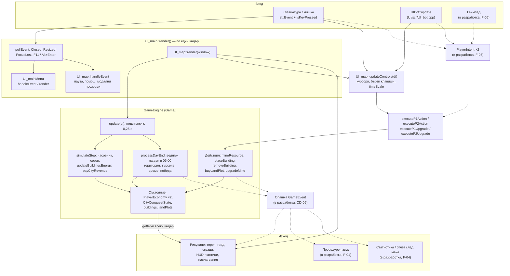
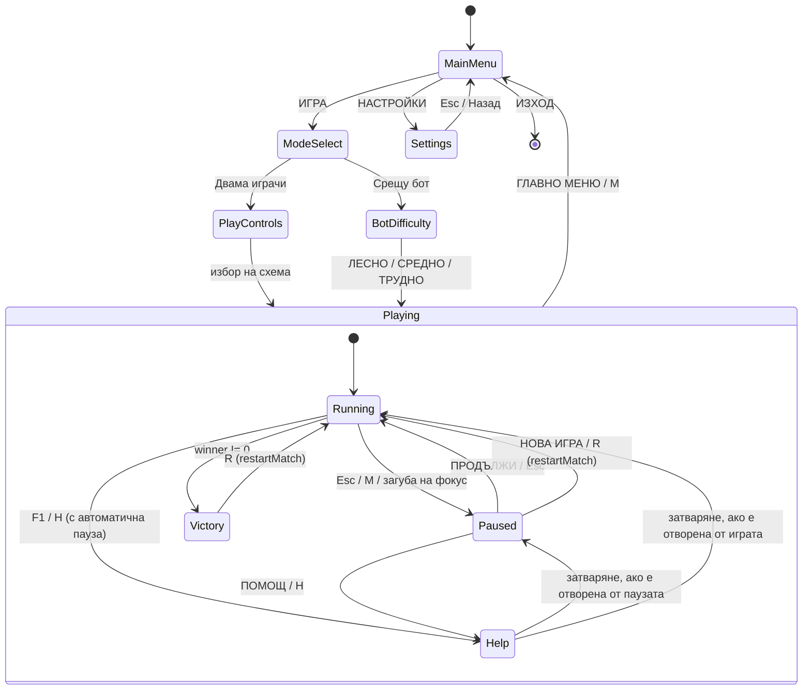

> Чернова — ще бъде финализирана след приключване на разработката.

# Архитектура на Energy Crisis

Документът описва как е устроен кодът на **Energy Crisis**: локална 1v1 стратегия в реално време на C++17 и SFML 3. Описано е състоянието на клон `Claude-code` към 03.10.2026 (последен commit `0ee54a6`). Всичко, което още не съществува в кода, е отбелязано с **(в разработка)**. Номерата на редове са към тази версия и може да се разместят при следващи промени.

## Съдържание

1. [Общ преглед](#1-общ-преглед)
2. [Основен цикъл и поток на данните](#2-основен-цикъл-и-поток-на-данните)
3. [Основни класове](#3-основни-класове)
4. [Игрови цикъл и време](#4-игрови-цикъл-и-време)
5. [Машина на състоянията](#5-машина-на-състоянията)
6. [MatchConfig (в разработка)](#6-matchconfig-в-разработка)
7. [PlayerModifiers (в разработка)](#7-playermodifiers-в-разработка)
8. [Опашка от събития (в разработка)](#8-опашка-от-събития-в-разработка)
9. [Случайни числа и детерминизъм](#9-случайни-числа-и-детерминизъм)
10. [Запис и зареждане (в разработка)](#10-запис-и-зареждане-в-разработка)
11. [Файл с настройки (в разработка)](#11-файл-с-настройки-в-разработка)
12. [Ресурси (assets) и пътища](#12-ресурси-assets-и-пътища)
13. [Слоеве на рендериране и производителност](#13-слоеве-на-рендериране-и-производителност)
14. [Система за компилация](#14-система-за-компилация)
15. [Дърво на папките](#15-дърво-на-папките)
16. [Конвенции в кода](#16-конвенции-в-кода)

---

## 1. Общ преглед

Кодът е разделен на две части: **енджин** (`Game/`) и **потребителски интерфейс** (`UI/`).

| Папка | Какво съдържа | Зависимости |
| --- | --- | --- |
| `Game/` | Правилата и симулацията: време, сезони, време (метеорология), енергийна мрежа, батерии и лампи, ресурси, земя, градско влияние, условия за победа. | Само стандартната библиотека и `sf::Vector2f` / `sf::FloatRect` от `<SFML/Graphics.hpp>` (`Game/includes/game_main.h:6`). Не рисува и не чете вход. |
| `UI/` | Фронтенд на SFML 3: прозорец, менюта, карта, HUD, частици, обучение, компютърен опонент (бот), обработка на клавиатура и мишка. | SFML 3 (graphics, window, system) и енджинът. |
| `main.cpp` | Входна точка: намира папката `assets/`, създава `UI_main` и пуска цикъла. | `UI/` |
| `scratch/` | Пет самостоятелни тестови програми за енджина и заместител на SFML (`scratch/sfml_stub/`), който позволява тестове без SFML. Виж [TESTING.md](TESTING.md). | Само `Game/` |
| `assets/` | `font.ttf` (шрифт с кирилица) и `grass.png` (текстура на терена). | — |

Основният принцип: **енджинът е източникът на истината** за правилата. UI само чете състоянието чрез getter-и и вика действия (`mineResource`, `placeBuilding`, `buyLandPlot`, `upgradeMine`). Принципът още не се спазва навсякъде:

- UI получава изменяем достъп до икономиката чрез `getPlayerEconomyMut()` (`Game/includes/game_main.h:214`), за да смени избраната сграда.
- Ударите на мълнии (които унищожават сгради) се решават в системата за частици на UI (`UI/scr/UI_map_particles.cpp:79-132`).
- Ботът живее в `UI/` (`UI/scr/UI_bot.cpp`), макар да е чиста логика. Виж [AI.md](AI.md).
- `UI_buildings` копира цените на сградите директно от `Balance::` (`UI/scr/UI_buildings.cpp:25-57`), вместо да пита енджина (CD-11).

Тези точки се премахват постепенно (CD-03, CD-05, CD-11, F-05).

## 2. Основен цикъл и поток на данните

Диаграмата показва един кадър. Плътните стрелки са днешният код. Пунктирните стрелки и възлите с „(в разработка)“ са планираната архитектура.



Ред на изпълнение в един кадър (днес):

1. `UI_main::render()` изпразва опашката от SFML събития и ги подава на менюто или на картата (`UI/scr/UI_main.cpp:64-96`).
2. Обработват се преходите между екрани (старт на мач, връщане в менюто, цял екран) (`UI/scr/UI_main.cpp:98-122`).
3. `UI_map::render()` измерва `dt` и, ако играта не е в пауза и няма победител, вика `engine.update(dt)`, `updateControls(dt)`, `updateWeatherParticles(dt)` и `tutorial.update(dt)` (`UI/scr/UI_map.cpp:250-260`).
4. Същата функция рисува всички слоеве (виж [раздел 13](#13-слоеве-на-рендериране-и-производителност)).
5. `window.display()` (`UI/scr/UI_main.cpp:133`).

Действията на бота минават по **същия път** като тези на човека: ботът само мести курсора на Играч 2 и „натиска“ действие, а `executeP2Action()` вика енджина (`UI/scr/UI_map_controls.cpp:454-481`). Затова ботът спазва същите правила и цени.

## 3. Основни класове

### Енджин (`Game/`)

| Клас / тип | Файл | Отговорност |
| --- | --- | --- |
| `GameEngine` | `Game/includes/game_main.h:139`, `Game/scr/game_main.cpp` | Цялата симулация: часовник и сезони, дневно време по сектор, енергийна мрежа (генератори, батерии, лампи), приходи, дневно отчитане, победа, действия на играчите, геометрия на грида. |
| `PlayerEconomy` | `Game/includes/game_main.h:93` | Състояние на един играч: 7 ресурса, пари, `energyMW`, `cityInfluence`, `selectedBuilding`, `mineLevels[8]`. Полето `data` (`PlayerData`) е дублиращо огледало, което никой не чете (CD-12). |
| `CityConquestState` | `Game/includes/game_main.h:112` | Градът: търсене (MW), дял на Играч 1 (`p1CityShare`), доставена енергия за деня (`p1DailyDelivered`, `p2DailyDelivered`, `dailySeconds`), последно съобщение и `winner` (0 = няма, 1 = Играч 1, 2 = Играч 2, 3 = равенство). |
| `PlacedBuilding` | `Game/includes/game_main.h:73` | Поставена сграда: тип, позиция, собственик, текуща мощност, заряд и капацитет (батерия), радиус на светлината (лампа). `isBroken` не се използва (B10). |
| `LandPlot` | `Game/includes/game_main.h:85` | Парцел: `id`, собственик, граници, закупен ли е, цена в злато. 12 парцела на играч, всеки с 3×3 клетки. |
| `BuildingCost`, `BuildingType`, `ResourceType` | `Game/includes/game_main.h:32-71` | Рецепти и изброявания. `ResourceType::ORE` е наследство, ползвано само от стари тестове. |
| `namespace Balance` | `Game/includes/game_balance.h`, `Game/includes/game_time.h` | Всички числа и формули: рецепти, добиви, ъпгрейди на мини, цени на земя, търсене на града, приходи, дневно изместване на територията, победа, продължителност на деня, изгрев и залез по сезони. |
| `WeatherSystem`, `weather_report()` | `Game/includes/game_weather.h`, `Game/scr/game_weather.cpp` | Множители за слънце, вятър и ВЕЦ; дневно „хвърляне“ на времето по сезон. |
| `randomInt()`, `seedRandom()` | `Game/includes/game_random.h`, `Game/scr/game_random.cpp` | Общ генератор `std::mt19937` за времето. |
| `Expedition()` | `Game/scr/game_expedition.cpp` | Неизползван код от ранна версия (B22). |

### Интерфейс (`UI/`)

| Клас / файл | Отговорност |
| --- | --- |
| `UI_main` (`UI/includes/UI_main.h`, `UI/scr/UI_main.cpp`) | Прозорец 1600×900, виртуално платно с черни ленти при друго съотношение (`updateViewport`), цял екран, горно ниво на машината на състоянията (`UIState`). |
| `UI_mainMenu` (`UI/scr/UI_mainMenu.cpp`) | Главно меню, избор на режим, на трудност на бота и екран с настройки (`MenuState`). |
| `UI_playControls` (`UI/scr/UI_playControls.cpp`) | Избор на схема за управление (`ControlScheme`). |
| `UI_map` (`UI/includes/UI_map.h`, `UI/scr/UI_map.cpp`) | Оркестратор на мача: притежава `GameEngine`, всички UI компоненти, бота и обучението; реда на рисуване; `restartMatch()`. |
| `UI_map_controls.cpp` | Вход: курсори, действия, бързи клавиши, ускорение на времето, събития за пауза, помощ и модални прозорци, управление на бота. |
| `UI_map_overlays.cpp` | HUD, меню за пауза, екран „Помощ и правила“, екран за победа. |
| `UI_map_particles.cpp` | Дъжд, сняг, листа, звезди, искри от добив и мълнии (включително, засега, унищожаването на сгради). |
| `UI_map_popups.cpp` | Странични изскачащи карти, плаващи съобщения, модални диалози. |
| `UIBot` (`UI/includes/UI_bot.h`, `UI/scr/UI_bot.cpp`) | Компютърен опонент за Играч 2. Виж [AI.md](AI.md). |
| `UI_tutorial` (`UI/scr/UI_tutorial.cpp`) | Интерактивно обучение с прожектор и стрелки. |
| `UI_city` (`UI/scr/UI_city.cpp`) | Градът, реката, мостовете, нощните светлини и лентата на влиянието. |
| `UI_resourceNodes` (`UI/scr/UI_resourceNodes.cpp`) | Мините (`ResourceStation`), парцелите, сградите и „призрака“ при поставяне. |
| `UI_buildings` (`UI/scr/UI_buildings.cpp`) | Страничните менюта със сгради. |
| `UI_resourceHUD` (`UI/scr/UI_resourceHUD.cpp`) | Индикаторите за ресурси в долните ъгли и бутонът за земя. |
| `UI_clock` (`UI/scr/UI_clock.cpp`) | Часовниците с ден, сезон и време. |
| `UI_types.h` | `VIRTUAL_WIDTH/HEIGHT`, `toUtf8()`, `ControlScheme`, `BotDifficulty`, `FloatingNotice`. |
| `UI_icons` (в разработка) | Процедурни икони за ресурси и сгради (виж [раздел 12](#12-ресурси-assets-и-пътища)). |

## 4. Игрови цикъл и време

### Днес: променлива стъпка, ограничена до 0,05 s

- Прозорецът е ограничен до 60 FPS (`UI/scr/UI_main.cpp:9`), а автоматичното повтаряне на клавиши е изключено.
- `UI_map::render()` взема реалното време от последния кадър и го ограничава до **0,05 s** (`UI/scr/UI_map.cpp:251-252`). Това `dt` отива в енджина, в таймерите на UI и в бота.
- `GameEngine::update(dt)` умножава по `timeScale` и разделя времето на подстъпки от най-много **0,25 игрови секунди** (`MAX_SIM_STEP_SEC`, `Game/scr/game_main.cpp:12`). Подстъпка никога не прекосява границата 06:00. Така всеки ден се отчита **точно веднъж** и с точно своята енергия, независимо от размера на кадъра (`Game/scr/game_main.cpp:158-185`).
- Приходите от града се изплащат веднъж на всяка игрова секунда. Таймерът `revenueTimer` е член на класа и пренася остатъка (`Game/scr/game_main.cpp:197-202`), затова доходът не зависи от FPS.

Последствия от ограничението 0,05 s: под 20 FPS играта започва да тече по-бавно от реалното време, а точната последователност от `dt` влияе на UI таймерите и на бота, така че мач в UI не може да се повтори кадър по кадър.

### Часовник и календар

| Величина | Стойност | Къде |
| --- | --- | --- |
| Продължителност на денонощието | 90 s (1 игрови час = 3,75 s) | `Balance::SECONDS_PER_DAY`, `Game/includes/game_time.h:18` |
| Начало на мача | 08:00 на ден 1 | `MATCH_START_HOUR`, `game_time.h:29` |
| Смяна на деня и дневно отчитане | 06:00 | `CLOCK_HOUR_AT_ZERO`, `game_time.h:28` |
| Смяна на сезона | на всеки 5 дни, в полунощ преди новия ден | `DAYS_PER_SEASON`, `getSeasonAtGameSeconds()`, `game_time.h:30, 48` |
| Гратисен период | дни 1–2 (търсене 0 MW) | `GRACE_PERIOD_DAYS`, `game_time.h:19` |
| Ускорение при добив | ×6, само докато **всички** играчи-хора са в ресурсна зона; ботът не ускорява времето | `MINE_SPEEDUP_MULT`, `UI/scr/UI_map_controls.cpp:393-398` |
| Пауза между добивите | 1 s | `MINE_COOLDOWN_SEC`, `UI/scr/UI_map_controls.cpp:225, 303` |
| Край на мача | 85% от града в края на ден или след края на ден 20 | `VICTORY_SHARE`, `FINAL_DAY`, `Game/includes/game_balance.h:198-200` |

### План: фиксирана стъпка 60 Hz (в разработка, CD-04)

```cpp
// UI_map::render() — схема
accumulator += std::min(frameSeconds, 0.25f);
while (accumulator >= kTick) {        // kTick = 1.0f / 60.0f
    engine.update(kTick);
    updateControls(kTick);            // по-късно: прилагане на PlayerIntent
    accumulator -= kTick;
}
// рисуването интерполира или просто показва последното състояние
```

`deltaClock` трябва да се рестартира при излизане от пауза и при нов мач (при нов мач това вече се прави в `UI/scr/UI_map.cpp:236`). Фиксираната стъпка, заедно с детерминистичния генератор (раздел 9) и записа на `PlayerIntent`, прави възможни повторенията (replays) и сравняването на състоянието в тестове.

## 5. Машина на състоянията

Състоянието е разпределено на три нива:

1. `UIState` в `UI_main`: `MAIN_MENU`, `PLAYING`, `QUIT` (`UI/includes/UI_main.h:8-12`).
2. `MenuState` в `UI_mainMenu`: `MAIN`, `MODE_SELECT`, `PLAY_CONTROLS`, `BOT_DIFFICULTY`, `SETTINGS` (`UI/includes/UI_mainMenu.h:9-15`).
3. Флагове в `UI_map` по време на игра: `isPaused`, `showHelpOverlay`, `helpOpenedFromPause`, активно обучение и `engine.getCityState().winner != 0` (екран за победа).



Бележки:

- Изборът на режим „Срещу бот“ отива направо към трудността, без екран за схема на управление. В този режим Играч 1 се движи с `WASD` или със стрелките, може да ползва и останалите клавиши на Играч 2, а кликовете с мишката винаги действат за Играч 1 (`UI_map::mouseOwnerAt`, `UI/scr/UI_map_controls.cpp:27-36`).
- При загуба на фокус играта влиза в пауза (`UI_map::onFocusLost`, `UI/scr/UI_map_controls.cpp:75-82`), а `updateControls` спира да чете клавиатурата, докато прозорецът е неактивен (`UI/scr/UI_map_controls.cpp:372-377`).
- Клавишът `M` отваря паузата на „ПРОДЪЛЖИ“, за да не излезе играчът от мача с едно случайно натискане.
- `restartMatch()` нулира енджина и цялото състояние на UI за мача (`UI/scr/UI_map.cpp:182-239`), прилага отново избраната трудност (на ТРУДНО обучението се пропуска) и подготвя клавишите, така че натискането, което е стартирало мача, да не се отчете като действие.
- Обучението задържа бота най-много 60 реални секунди (`TUTORIAL_BOT_HOLD_SEC`, `UI/includes/UI_map.h:188`).

## 6. MatchConfig (в разработка)

Днес правилата на мача са константи по време на компилация в `namespace Balance`. Планът (F-03) е структура `MatchConfig`, която `GameEngine` получава при `init()` и използва вместо константите. Менюто ще предлага готови профили BLITZ, STANDARD, MARATHON и ENDLESS, както и потребителски.

| Поле (предложение) | Днешна константа | Стойност в STANDARD |
| --- | --- | --- |
| `secondsPerDay` | `Balance::SECONDS_PER_DAY` | 90 s |
| `graceDays` | `Balance::GRACE_PERIOD_DAYS` | 2 |
| `dayLimit` (0 = без край) | `Balance::FINAL_DAY` | 20 |
| `startDemandMW` | `Balance::STARTING_CITY_DEMAND_MW` | 30 MW |
| `demandGrowthMW` | `Balance::DAILY_DEMAND_INCREASE_MW` | 15 MW на ден |
| `dominanceShare` | `Balance::VICTORY_SHARE` | 0,85 |
| `minDailyShift` / `maxDailyShift` | `MIN_DAILY_CITY_SHIFT` / `MAX_DAILY_CITY_SHIFT` | 0,10 / 0,15 |
| `miningMult` | — (добивите са фиксирани) | 1,0 |
| `mutators` (битова маска, F-24) | — | няма |
| `charter[2]` (F-35) | — | няма |
| `seed` (0 = от часовника) | `EC_SEED` или часовник | — |

Изисквания: стойностите се валидират при създаване; `MatchConfig` се записва във файла за запис (раздел 10) и в отчета след мача; тестовете създават енджин с конкретна конфигурация вместо да разчитат на глобални константи.

## 7. PlayerModifiers (в разработка)

Днес двамата играчи винаги започват еднакво и имат еднакви цени и мощности. Три одобрени функции добавят разлики между играчите: стартови харти (F-35), изследвания (F-33) и мутатори (F-24). За да не се пръснат проверки из целия код, всички те ще се събират в една структура на играч:

```cpp
// Предложение — Game/includes/game_modifiers.h (в разработка)
struct PlayerModifiers {
    float buildCostMult[7]   = {1,1,1,1,1,1,1}; // по BuildingType
    float outputMult[4]      = {1,1,1,1};       // слънце, вятър, ВЕЦ, (резерв)
    float batteryCapacityMult = 1.0f;
    float lampDrawMult        = 1.0f;
    float miningYieldMult     = 1.0f;
    float miningCooldownMult  = 1.0f;
    float landCostMult        = 1.0f;
};
```

Правила:

- `GameEngine` пази `PlayerModifiers` за всеки играч и ги пресмята наново, когато се смени харта, изследване или мутатор.
- Цените се четат само чрез `getBuildingCost(player, type)`. UI спира да чете `Balance::` директно (CD-11), иначе менютата ще показват грешни цени.
- Ботът използва същата функция, за да смята дефицита си (виж [AI.md](AI.md)).
- Преди пускане всяка харта се проверява чрез симулации бот срещу бот (цел: никоя харта над 55% победи).

## 8. Опашка от събития (в разработка)

Днес енджинът връща резултат като `bool` и български текст в `outMsg`, а UI решава какво да покаже. Флагът `city.dayCutOccurred` се вдига (`Game/scr/game_main.cpp:354`), но никой не го чете; съобщението за деня се показва чрез `city.lastCutMessage`.

План (CD-05):

```cpp
// Предложение
enum class GameEventType { ResourceMined, BuildingPlaced, BuildingRemoved, LandBought,
                           MineUpgraded, DaySettled, LightningStrike, BuildingDestroyed, MatchEnded };
struct GameEvent {
    GameEventType type;
    int player;          // 0 = и двамата / градът
    sf::Vector2f pos;    // по-късно собствен тип Vec2 (енджин без SFML)
    int value;           // количество, MW, % територия, ниво ...
};
std::vector<GameEvent> GameEngine::drainEvents(); // UI_map я вика веднъж на кадър
```

Събитията се добавят в `mineResource`, `placeBuilding`, `removeBuilding`, `buyLandPlot`, `upgradeMine`, `processDayEnd` и в бъдещия енджинен график на мълниите. Консуматори: рисуване на ефекти и съобщения, процедурният звук (F-01), статистиката и отчетът след мача (F-04), развиващата се част от обучението. Действията на бота автоматично пораждат същите събития като тези на човека.

## 9. Случайни числа и детерминизъм

### Днес

- `Game/scr/game_random.cpp` държи един общ `std::mt19937` и функциите `seedRandom()` и `randomInt()`. От него се тегли времето (метеорологията).
- При всеки нов мач `GameEngine::init()` избира семе: променливата на средата `EC_SEED`, ако е зададена и е число, иначе стойност от часовника (`pickMatchSeed`, `Game/scr/game_main.cpp:15-30`). Семето се подава на `seedRandom()` и на `std::srand()` и се отпечатва: `RNG seed: N ... Set EC_SEED=N to replay this match.` (`Game/scr/game_main.cpp:53-58`).
- Енджинът сам по себе си е детерминистичен при еднакво семе и еднаква поредица от извиквания. Тестът `testSeedReproducible` в `scratch/test_regressions.cpp` го проверява.

Какво все още **не** е детерминистично в играта:

| Източник | Къде | Защо е проблем |
| --- | --- | --- |
| `std::rand()` за мълнии | `UI/scr/UI_map_particles.cpp:96-130` | Геймплей решение (унищожаване на сграда) в UI, на общ поток с визуалните частици. |
| `std::rand()` за бота | `UI/scr/UI_bot.cpp:148, 173` | Същият общ поток; броят на частиците влияе на решенията на бота. |
| `std::rand()` за частици | `UI/scr/UI_map.cpp:37-40`, `UI_map_particles.cpp` | Изразходва числа от потока според кадрите. |
| Глобални променливи за времето | `weather_state`, `wind`, `wind_direction` (`Game/includes/game_weather.h:8-10`) | Скрито глобално състояние. |
| Променлива стъпка | `UI/scr/UI_map.cpp:251-252` | Резултатът зависи от поредицата `dt`. |
| `std::uniform_int_distribution` | `Game/scr/game_random.cpp` | Реализацията е различна в libstdc++ и MSVC: едно и също семе може да даде различно време на различни компилатори. |

### План (CD-03, в разработка)

1. Генератор, собственост на `GameEngine`, с отделни потоци: време, опасности (мълнии), бот. Собствена преносима функция за интервал вместо `uniform_int_distribution`.
2. Глобалните променливи за времето стават членове на енджина.
3. Графикът на мълниите се мести в `GameEngine::update` и съобщава ударите чрез опашката от събития (раздел 8); UI само рисува.
4. Ботът тегли само от своя поток (виж [AI.md](AI.md)).
5. Фиксирана стъпка 60 Hz (раздел 4).
6. Тест: едно и също семе и една и съща поредица от действия дават еднакъв хеш на състоянието след 20 дни.

## 10. Запис и зареждане (в разработка)

Днес играта не чете и не пише файлове (няма `fstream`/`fopen` в `Game/`, `UI/` и `main.cpp`), а състоянието на енджина е частно и няма сериализация.

План (F-18):

- `GameEngine::save(std::ostream&)` и `GameEngine::load(std::istream&)` в текстов формат `ключ=стойност` с номер на версията.
- `UI_map::saveTo()` / `loadFrom()` за курсорите, схемата за управление, трудността на бота и състоянието на обучението.
- Автоматичен запис в края на последните 3 дни, бърз запис и зареждане с `F5` / `F9`, 3 слота в менюто за пауза.
- Място (предложение): `%APPDATA%\EnergyCrisis\saves\` под Windows, `~/.local/share/energy-crisis/saves/` под Linux.

Примерен формат (предложение, може да се промени):

```ini
ec_save_version=1
match.seed=1234567
match.config=STANDARD
rng.weather=<сериализирано състояние на std::mt19937>
time.gameSeconds=812.25
time.day=10
city.demand=135
city.p1Share=0.65
p1.wood=42
p1.gold=310
p1.mineLevels=2,1,1,1,1,1,1,1
plot=14,purchased
building=WIND_TURBINE,1120.5,140.2,2,0
building=BATTERY,375.0,250.0,1,180.0
ui.controlScheme=BOTH_KEYBOARD
ui.botDifficulty=MEDIUM
```

Записът трябва да включва и състоянието на генератора, иначе заредената игра ще продължи с различно време.

## 11. Файл с настройки (в разработка)

Днес екранът „Настройки“ има сила на звука (0–100%), звукови ефекти и трудност на бота по подразбиране (`UI/includes/UI_mainMenu.h:31-34`). Стойностите живеят само в паметта: не се записват и, без звукова система, силата на звука не се използва.

План (F-06): нов модул `UI_settings.{h,cpp}`, собственост на `UI_main`, който чете и пише `settings.ini` във формат `ключ=стойност` в папката на потребителя (`%APPDATA%\EnergyCrisis\` под Windows, `~/.config/energy-crisis/` под Linux).

| Ключ (предложение) | Пример | Описание |
| --- | --- | --- |
| `window.width`, `window.height` | `1600`, `900` | Размер на прозореца |
| `window.fullscreen` | `0` | Цял екран при стартиране |
| `window.fpsLimit` | `60` | Ограничение на кадрите |
| `audio.master`, `audio.sfx`, `audio.music` | `80`, `100`, `60` | Сила на звука в % (F-01) |
| `ui.popupSeconds` | `4.0` | Време за изскачащите карти |
| `ui.language` | `bg` | `bg` или `en` (F-20) |
| `tutorial.policy` | `auto` | `auto` / `always` / `never` |
| `bot.defaultDifficulty` | `MEDIUM` | Предварително избрана трудност |

Неизвестни ключове се пропускат, а липсващият или повреден файл връща стойностите по подразбиране.

## 12. Ресурси (assets) и пътища

| Файл | Използва се от | Без него |
| --- | --- | --- |
| `assets/font.ttf` | `UI_mainMenu` (`UI/scr/UI_mainMenu.cpp:19`) и `UI_map` (`UI/scr/UI_map.cpp:27`); шрифтът се зарежда два пъти (PF-05) | Няма текст. Обучението и модалните диалози се изключват, за да не блокират играта (`UI/scr/UI_map.cpp:262-268`). |
| `assets/grass.png` | `UI_map` (`UI/scr/UI_map.cpp:21`) | Терен в плътен зелен цвят. |

Пътищата в кода са относителни (`"assets/..."`). `main.cpp` (`selectAssetDirectory`) първо търси `assets/font.ttf` до изпълнимия файл (под Linux чрез `/proc/self/exe`, иначе чрез `argv[0]`) и прави тази папка текуща. Ако там няма ресурси, остава текущата папка; ако и там ги няма, извежда грешка в конзолата.

**Икони (в разработка, DS-04).** Иконите ще са процедурни, без файлове с изображения: модул `UI_icons.h` / `UI_icons.cpp`, който в момента е готов извън репото и предстои да се добави в `UI/`. Той рисува векторни икони с `sf::ConvexShape` и `sf::CircleShape` в нормализирана кутия:

```cpp
void drawResourceIcon(sf::RenderTarget& t, ResourceType r, sf::Vector2f center, float size);
void drawBuildingIcon(sf::RenderTarget& t, BuildingType b, sf::Vector2f center, float size);
sf::Color resourceIconColor(ResourceType r);
```

Всеки ресурс и всяка сграда имат собствен силует (дърво, слитък, макара, скала, чип, кристал, монета, банкнота, мълния; панел, турбина, колело, клетка, лампа, чук), за да се различават и от далтонисти, а не само по цвят. Иконите са четими от 16 px нагоре.

**Звук (в разработка, F-01).** Планира се процедурен звук: звуците се синтезират в кода при стартиране (масиви от отчети → `sf::SoundBuffer`), без аудио файлове. `AudioDirector`, собственост на `UI_main`, ще пуска ефектите по събитията от раздел 8 с панорама (Играч 1 вляво, Играч 2 вдясно) и ще чете силата на звука от настройките. Изисква свързване с `sfml-audio`.

## 13. Слоеве на рендериране и производителност

Всичко се рисува върху виртуално платно 1600×900; `UI_main::updateViewport()` добавя черни ленти, когато прозорецът има друго съотношение (`UI/scr/UI_main.cpp:22-47`). Редът в `UI_map::render()` (`UI/scr/UI_map.cpp:284-378`), отдолу нагоре:

| # | Слой | Функция |
| --- | --- | --- |
| 1 | Трева и оттенък на небето (зора, залез, нощ) | `drawGrassBackground` |
| 2 | Река и разделителна линия | `UI_city::drawDividingRiver` |
| 3 | Парцели | `UI_resourceNodes::drawLandPlots` |
| 4 | Енергийни проводи с импулси | `drawEnergyConduits` |
| 5 | Поставени сгради | `UI_resourceNodes::drawPlacedBuildings` |
| 6 | „Призрак“ на избраната сграда | `UI_resourceNodes::drawBuildingGhost` |
| 7 | Градът и лентата на влиянието | `UI_city::drawCity`, `drawInfluenceBar` |
| 8 | Мини и гори, подсказки за добив | `UI_resourceNodes::drawNodes`, `drawMiningZonesAndBadges` |
| 9 | Часовници | `UI_clock::draw` |
| 10 | Менюта със сгради | `UI_buildings::draw` |
| 11 | Ресурси в ъглите | `UI_resourceHUD::drawQuarterCircle` |
| 12 | Странични изскачащи карти | `drawPlayerPopups` |
| 13 | HUD (бутони за меню и цял екран) | `drawHUD` |
| 14 | Време (частици) и мълнии | `drawWeatherParticles` |
| 15 | Искри от добив | `drawMiningParticles` |
| 16 | Модални диалози | `drawPlayerModals` |
| 17 | Обучение (прожектор и стрелки) | `UI_tutorial::draw` |
| 18 | Курсори на играчите | `drawPlayerCursors` |
| 19 | Плаващи съобщения | `drawFloatingNotices` |
| 20 | Екран за победа или меню за пауза | `drawVictoryScreen` / `drawPauseMenu` |
| 21 | „Помощ и правила“ — винаги най-отгоре | `drawHelpOverlay` |

Известно е, че частиците за времето се рисуват върху HUD (слой 14 над слоеве 9–13); UX-09 предлага да слязат под HUD.

### Бележки за производителността (в разработка)

Играта е ограничена до 60 FPS и на съвременен компютър обикновено работи гладко, но рисуването е неефективно. Одобрени подобрения:

| ID | Проблем днес | Решение |
| --- | --- | --- |
| PF-01 | Около 28 извиквания `draw` на закупен парцел (до 672) и 242 прозореца на града всеки кадър | Кеширан `sf::VertexArray`, който се обновява само при промяна |
| PF-02 | Около 150 обекта `sf::Text` и низове се създават всеки кадър | Кеширани надписи, които се обновяват при промяна на стойността |
| PF-03 | 130 частици и всеки импулс по проводите (две `CircleShape`) се рисуват поотделно | Един `sf::VertexArray` на вид частица |
| PF-04 | `processPlayerGrid` заделя 2–3 вектора на играч на кадър, а `getBuildingCost` копира структура с два `std::string` | Таблица `constexpr` с мощностите и преизползвани буфери |
| PF-05 | `mapPixelToCoords` се вика около 7 пъти на кадър, шрифтът се зарежда два пъти | Една позиция на мишката на кадър, общ мениджър на ресурсите |

Измерванията ще се показват в развойния панел (CD-15, в разработка): FPS, време на кадър, брой сгради и частици, семе, ден и час, клавиши за промяна на скоростта.

## 14. Система за компилация

### Днес: `Makefile`

| Команда | Какво прави |
| --- | --- |
| `make` | Компилира `main.cpp`, `UI/scr/*.cpp` и `Game/scr/*.cpp` с една команда до `test_game` (под Windows `test_game.exe`) със `-std=c++17 -Wall -Wextra` и свързва `sfml-graphics`, `sfml-window`, `sfml-system`. |
| `make run` | Компилира и пуска `./test_game`. |
| `make test` | Компилира всеки `scratch/test_*.cpp` само с енджина и заместителя на SFML и го пуска (виж [TESTING.md](TESTING.md)). |
| `make clean` | Изтрива `test_game` и `scratch/bin/` (ползва `rm`, затова под Windows се пуска от Git Bash или MSYS2). |

Ограничения: основната цел няма зависимости от заглавните файлове (промяна само в `game_balance.h` не предизвиква прекомпилация) и всичко се компилира наново всеки път. Тестовата цел вече ползва обектни файлове и зависи от заглавните файлове.

### План: CMake (в разработка, CD-01)

- Цели: `ec_engine` (статична библиотека от `Game/scr/*.cpp`), `energy_crisis` (играта), `ec_tests` (тестовете).
- `find_package(SFML 3 COMPONENTS Graphics Window System Audio)` с резервен вариант `FetchContent` към фиксирана версия на SFML 3.
- Копиране на `assets/` до изпълнимия файл след компилация.
- `/utf-8 /W4` за MSVC (изходните файлове са UTF-8 без BOM и съдържат кирилица), `-Wall -Wextra` за GCC/Clang; по-късно `-Wconversion -Werror` в CI (CD-13).
- `enable_testing()` и `ctest`. Makefile остава, но получава `-MMD -MP` и `$(RM)`.

### Компилация под Linux

SFML 3 обикновено не е в пакетите на дистрибуциите (там често е SFML 2.x, с който кодът не се компилира), затова се компилира от изходен код. Примерни команди за Ubuntu/Debian (за проверка при финалния преглед):

```bash
sudo apt install build-essential cmake git libx11-dev libxrandr-dev libxcursor-dev libxi-dev \
     libudev-dev libgl1-mesa-dev libfreetype-dev libflac-dev libvorbis-dev libopenal-dev
git clone --depth 1 --branch 3.1.0 https://github.com/SFML/SFML.git   # или по-нов таг 3.x
cmake -S SFML -B SFML/build -DCMAKE_BUILD_TYPE=Release -DBUILD_SHARED_LIBS=ON
cmake --build SFML/build -j
sudo cmake --install SFML/build && sudo ldconfig

cd Energy-Crisis
make            # -> ./test_game
make run
make test       # не изисква SFML
```

### Компилация под Windows (MinGW-w64 GCC 14 + SFML 3.1)

Изисквания: MinGW-w64 GCC 14 (например компилацията на WinLibs, 64-битова, SEH) и SFML 3.1.0, компилиран **за същия компилатор**. Команди от Git Bash в папката на проекта:

```bash
export PATH="/c/tools/mingw64/bin:$PATH"           # пътят до GCC 14
SFML=/c/tools/SFML-3.1.0                            # пътят до SFML

mingw32-make CXXFLAGS="-std=c++17 -Wall -Wextra -IUI/includes -IGame/includes -I$SFML/include" \
             LIBS="-L$SFML/lib -lsfml-graphics -lsfml-window -lsfml-system"

# DLL файлове до test_game.exe (или ги сложете в PATH)
cp "$SFML"/bin/sfml-graphics-3.dll "$SFML"/bin/sfml-window-3.dll "$SFML"/bin/sfml-system-3.dll .
cp /c/tools/mingw64/bin/{libstdc++-6.dll,libgcc_s_seh-1.dll,libwinpthread-1.dll} .
./test_game.exe
```

Папката `assets/` трябва да е до `test_game.exe` или в текущата папка; при пускане от корена на проекта тя се намира автоматично. Тестовете не изискват SFML: `mingw32-make test`.

Забележка: старият MinGW g++ 6.3 не поддържа напълно C++17 и не може да компилира SFML 3; с него се компилира само енджинът за тестовете (виж [TESTING.md](TESTING.md)).

## 15. Дърво на папките

```text
Energy-Crisis/
├── assets/
│   ├── font.ttf                 # шрифт с кирилица
│   └── grass.png                # текстура на терена
├── Game/                        # енджин: правила и симулация
│   ├── includes/
│   │   ├── game_balance.h       # всички числа и формули (namespace Balance)
│   │   ├── game_expedition.h    # неизползвано (B22)
│   │   ├── game_main.h          # GameEngine, PlayerEconomy, CityConquestState, ...
│   │   ├── game_random.h        # randomInt, seedRandom
│   │   ├── game_time.h          # време, сезони, изгрев/залез
│   │   └── game_weather.h       # WeatherType, SeasonType, WeatherSystem
│   └── scr/
│       ├── game_expedition.cpp
│       ├── game_main.cpp
│       ├── game_random.cpp
│       └── game_weather.cpp
├── UI/                          # SFML 3 фронтенд
│   ├── includes/                # UI_*.h (по един за всеки компонент) + UI_types.h
│   └── scr/
│       ├── UI_main.cpp          # прозорец и горна машина на състоянията
│       ├── UI_mainMenu.cpp      # менюта и настройки
│       ├── UI_playControls.cpp  # схеми за управление
│       ├── UI_map.cpp           # оркестратор на мача и ред на рисуване
│       ├── UI_map_controls.cpp  # вход, действия, бот, събития
│       ├── UI_map_overlays.cpp  # HUD, пауза, помощ, победа
│       ├── UI_map_particles.cpp # частици и мълнии
│       ├── UI_map_popups.cpp    # изскачащи карти и модални диалози
│       ├── UI_bot.cpp           # компютърен опонент
│       ├── UI_tutorial.cpp      # обучение
│       ├── UI_city.cpp, UI_resourceNodes.cpp, UI_buildings.cpp,
│       └── UI_resourceHUD.cpp, UI_clock.cpp
├── scratch/                     # тестове без SFML (make test)
│   ├── sfml_stub/               # SFML/Graphics.hpp (Vector2, Rect) + compat_cxx17.h
│   ├── test_100x_speed_simulation.cpp
│   ├── test_economy_balance.cpp
│   ├── test_grid_battery_lamp.cpp
│   ├── test_regressions.cpp
│   └── test_resource_cooldown.cpp
├── main.cpp
├── Makefile
└── README.md
```

Планирани допълнения (в разработка): `CMakeLists.txt` (CD-01), `.github/workflows/ci.yml` (CD-02), `tests/` с doctest (виж [TESTING.md](TESTING.md)), `docs/`, `UI/scr/UI_icons.cpp`, `UI/scr/UI_audio.cpp`, `UI/scr/UI_input.cpp` (PlayerIntent), `UI/scr/UI_settings.cpp`, `Game/scr/game_bot.cpp` (ботът, преместен в енджина).

## 16. Конвенции в кода

- **Език и стандарт:** C++17 и API на SFML 3 (`pollEvent()` връща `std::optional`, `event->getIf<>()`, `FloatRect::position` / `size`).
- **Имена на файлове:** `game_*` в `Game/`, `UI_*` в `UI/`. Заглавните файлове са в `includes/`, изходните — в `scr/` (точно така, не `src/`).
- **Имена в кода:** класове `PascalCase` в енджина (`GameEngine`, `PlayerEconomy`) и `UI_` + `camelCase` в интерфейса (`UI_map`, `UI_mainMenu`; изключение е `UIBot`). Методи и полета в `camelCase`. Константи в `UPPER_SNAKE_CASE` в `namespace Balance`. Изброявания като `enum class` със стойности в `UPPER_SNAKE_CASE`.
- **Играчи:** `int player` е 1 (Играч 1, западен сектор, циан) или 2 (Играч 2, източен сектор, розово/магента).
- **Числа за баланса:** само в `game_balance.h` и `game_time.h`. UI не трябва да пази свои копия (CD-11, CD-12).
- **Защита от многократно включване:** `#ifndef ..._H` в повечето заглавни файлове, `#pragma once` в `game_balance.h`, `game_time.h`, `game_random.h`, `game_expedition.h`. В нов код използвайте един от двата начина последователно в рамките на файла.
- **Текст:** изходните файлове са UTF-8 без BOM. Текстът за играча е на български и се подава на SFML през `toUtf8()` (`UI/includes/UI_types.h`). Коментарите в кода са на английски.
- **Граница енджин/UI:** енджинът не рисува и не чете клавиатура; UI не променя правилата. Новата логика влиза в `Game/`, а UI само я показва.
- **Предупреждения:** код без предупреждения с `-Wall -Wextra`; целта е и `-Wconversion` (CD-13).
- **Commit съобщения:** във формата `тип(област): описание`, например `fix(engine): ...`, `test: ...`.
